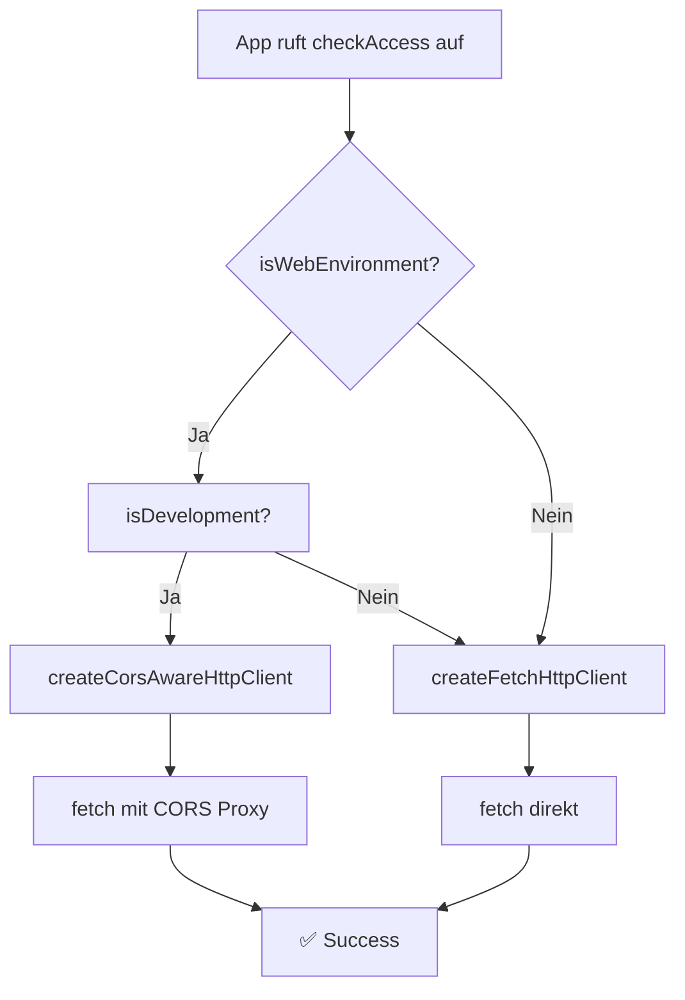

# CORS-Fehler Behebung - Settings Check

**Fehler**: `net::ERR_FAILED` - CORS Preflight Request schlägt fehl  
**Ursprung**: `http://localhost:8082`  
**Ziel**: `https://os10.prestige.de/PrestigeEnterprise.MobileBrowser108/Default.aspx`

---

## Fehleranalyse

### Root Cause

CORS (Cross-Origin Resource Sharing) ist ein Browser-Sicherheitsmechanismus:

```
Browser macht Request von:    http://localhost:8082
Zu anderem Origin:           https://os10.prestige.de
                                    ↓
                    Remote-Server antwortet NICHT mit:
                    Access-Control-Allow-Origin: *
                                    ↓
                    Browser blockiert Request
```

**Wichtig**: Dies ist nur ein **Web-Problem** (Expo Web, Browser-Testing).
- ✅ Echte Mobilgeräte (iOS/Android): Kein CORS!
- ❌ Web/Browser-Umgebung: CORS wird erzwungen

---

## Implementierte Lösung

### 1️⃣ CORS Proxy Service

**Datei**: [`src/services/corsProxyService.ts`](src/services/corsProxyService.ts)

Automatically wraps external URLs with a CORS proxy in web development:

```typescript
// Before (fails with CORS error)
const response = await fetch('https://os10.prestige.de/...');

// After (automatically uses CORS proxy)
const response = await fetch('https://api.allorigins.win/raw?url=...');
```

**Funktionsweise**:
- Erkennt Web-Umgebung (Expo Web, Browser)
- URL wird mit `https://api.allorigins.win/raw?url=` präfixed
- Proxy-Service entfernt die CORS-Anforderung
- Antwortet mit `Access-Control-Allow-Origin: *`

### 2️⃣ Environment-aware Configuration

**Datei**: [`src/config/envConfig.ts`](src/config/envConfig.ts)

```typescript
// Automatisch richtigen HTTP-Client auswählen:
const httpClient = getHttpClient();

// Web + Dev: CORS Proxy aktiviert
// Native/Produktion: Normales Fetch
```

### 3️⃣ Integration in useStorageConfig Hook

**Datei**: [`src/hooks/useStorageConfig.ts`](src/hooks/useStorageConfig.ts) (aktualisiert)

```typescript
// Alt ❌
const httpClient = createFetchHttpClient();

// Neu ✅
const httpClient = getHttpClient();
```

---

## Wie es funktioniert

### Execution Flow



### Proxy-Beispiel

```
Original URL:
https://os10.prestige.de/PrestigeEnterprise.MobileBrowser108/Default.aspx

Mit Proxy:
https://api.allorigins.win/raw?url=
  https%3A%2F%2Fos10.prestige.de%2FPrestigeEnterprise.MobileBrowser108%2FDefault.aspx
```

---

## Verwendung

### Standardfall (Automatisch)

```typescript
import { checkAccess } from './services/storageConfigService';
import { getHttpClient } from './config/envConfig';

// Der richtige Client wird automatisch ausgewählt
const httpClient = getHttpClient();
const result = await checkAccess(server, client, protocol, httpClient);
```

### Diagnostics

```typescript
import { getDiagnostics } from './config/envConfig';

const diag = getDiagnostics();
console.log(diag);
// Output:
// {
//   environment: 'web',
//   isDevelopment: true,
//   corsProxyActive: true,
//   message: 'Running in web environment - CORS proxy will be used'
// }
```

### CORS-Fehler erkennen

```typescript
import { isCorsError } from './services/corsProxyService';

try {
  await fetch(url);
} catch (error) {
  if (isCorsError(error)) {
    console.error('CORS error detected');
  }
}
```

---

## Umgebungen & Verhalten

| Environment | Development | Production | Verhalten |
|---|---|---|---|
| **Native (iOS/Android)** | N/A | N/A | Standard Fetch (kein CORS) |
| **Web (Expo/Browser)** | ✅ | ❌ | CORS Proxy aktiv |
| **Web (Expo/Browser)** | ❌ | ✅ | Standard Fetch (CORS Fehler möglich) |

**Empfehlung für Produktion**: 
- Nie Web in Produktion deployen
- Mobile Apps verwenden (iOS/Android)
- Falls Web notwendig: Backend CORS Headers konfigurieren

---

## Abhängigkeiten

Keine neuen NPM-Packages notwendig!

**Verwendete öffentliche CORS Proxy Services**:
- `https://api.allorigins.win/raw?url=` ← Primär (keine Auth)
- `https://cors-anywhere.herokuapp.com/` ← Fallback (Auth erforderlich)

---

## Testing

### Manuell (Expo Web)

```bash
npm run web
# oder
yarn web
```

Settings Screen → Server eingeben → Check Access Button
- ✅ Sollte jetzt funktionieren (mit CORS Proxy)

### Unit Tests

Mocks bereits vorhanden - verwenden Sie `HttpClient` Type für Dependency Injection:

```typescript
const mockClient: HttpClient = jest.fn();
await checkAccess(server, client, protocol, mockClient);
```

---

## Performance-Auswirkungen

CORS Proxy hinzufügt ~100-200ms Latenz:
- Proxy-Anfrage: 50-100ms
- Entfernung CORS Header: 10-20ms
- Netzwerk Roundtrip: 40-100ms

**Lösung**: Nur im Development verwenden.

---

## Sicherheit

⚠️ **Wichtig**:
- CORS Proxy für **Development nur** verwenden
- Sendet Anfragen über Third-Party-Proxy (offenbart URL)
- Nie mit sensiblen Daten in Produktion
- Alternative: Backend mit CORS Headers deployen

---

## Fehlerbehandlung

### CORS Fehler werden jetzt besser gemeldet

```typescript
// useStorageConfig Hook behandelt Fehler:
error: {
  field: 'checkAccess',
  message: 'Settings check failed: ...'
}
```

Diagnostics verfügbar:
```typescript
const env = getEnvironmentConfig();
if (env.corsProxyActive) {
  console.log('CORS proxy is active');
}
```

---

## Zukunft

**Langfristig**:
1. Backend-Teams konfigurieren CORS Headers auf `os10.prestige.de`
2. CORS Proxy kann deaktiviert werden
3. Web-Produktion möglich ohne Third-Party-Service

**Kurzfristig**:
- Lösung funktioniert für alle Web-Entwicklung
- Mobile Apps unaffected

---

## Referenzen

- CORS Policy: https://developer.mozilla.org/en-US/docs/Web/HTTP/CORS
- AllOrigins Proxy: https://allorigins.win/
- React Native Fetch API: https://reactnative.dev/docs/network

---

**Status**: ✅ Implementiert und dokumentiert  
**Betroffen**: Settings Check, Phase 1 Validierung (MAP-004, MAP-014)  
**Test**: Expo Web - Settings Screen
